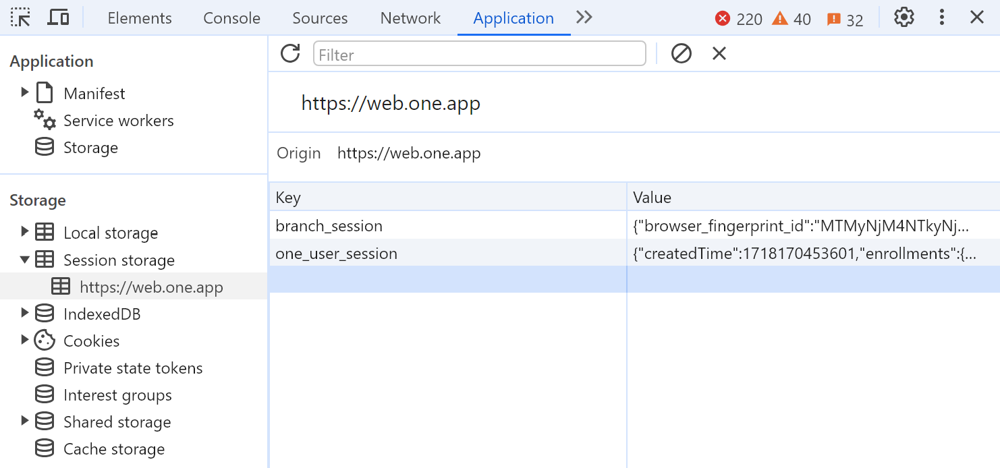

# ONE Finance Export
Connect to ONE Finance as a bank aggregator via their api and export transaction
and balance history to csv files

## Authentication
### one-finance-login
You can use my [other tool](https://github.com/JetUni/one-finance-login) as an
automated way to login to the ONE Finance website and save your user session.
This might be helpful if you have problems with this app refreshing your token
or don't understand how to copy the user session. However, the next option is my
preferred option for using this tool

### Copy from ONE website
1. Login to the ONE website at [https://web.one.app/](https://https://web.one.app/)
2. Open the developers tools
3. Go to "Application" > Expand "Session Storage" > Click "https://web.one.app"
    
4. Copy the value from the `one_user_session` key
5. Create a folder/file in this repo called `db/one-user-session.json`
6. Paste the value you copied from the webiste into this file and save it

## Using this tool
Run `npm start` to initialize the app and download a full history of your
transactions and balance history.

State will be stored in the `db` folder that you created in the previous steps
to keep track of which transactions have already been downloaded and which
balance history dates have already been exported. This makes subsequent calls
with this program quicker and more useful

The csv file output will be stored in a folder called `output`. You can copy
this into your existing programs that you use to track your finances.

The program is built to refresh your user token, so even though the tokens
expire every 24 hours, the program will refresh the access token before
continuing to pull transactions and balance history
